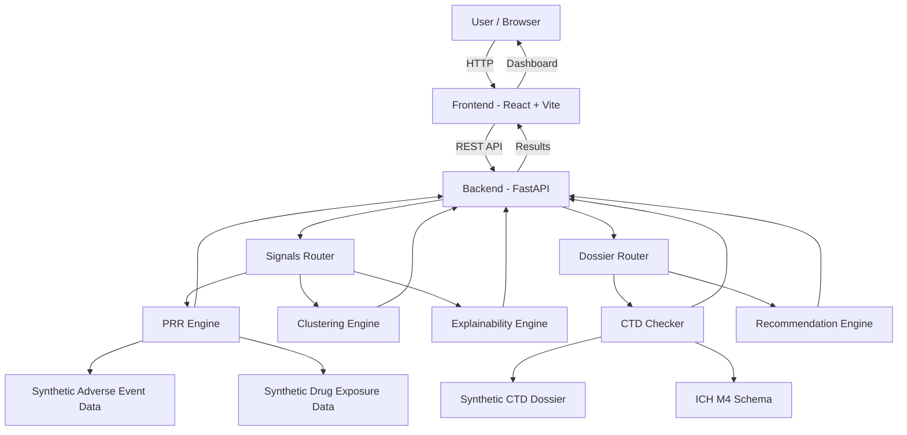

# Architecture

## System Architecture

PharmaGuard AI uses a React/Vite frontend connected to a FastAPI backend through REST APIs. The backend contains separate engines for drug-safety signal detection, clustering, explainability, CTD checking, and recommendations.

The prototype uses synthetic adverse-event data, synthetic drug-exposure data, and a synthetic ICH M4 CTD dossier.

## Components

| Component             | Technology       | Responsibility                                                                                                       |
| --------------------- | ---------------- | -------------------------------------------------------------------------------------------------------------------- |
| Frontend              | React + Vite     | Dashboard UI, user interaction, charts, tables, signal views, and submission-readiness views.                        |
| Backend API           | FastAPI / Python | Handles REST API requests and connects the frontend with the analysis engines.                                       |
| Signals Router        | FastAPI / Python | Provides endpoints for reports, PRR analysis, clustering, ranking, and signal explanations.                          |
| Dossier Router        | FastAPI / Python | Provides endpoints for CTD structure, completeness checking, schema information, and recommendations.                |
| PRR Engine            | Python           | Calculates Proportional Reporting Ratio values and evaluates potential drug-event signals.                           |
| Clustering Engine     | Python / K-Means | Groups patterns in the safety data using clustering.                                                                 |
| Explainability Engine | Python           | Provides supporting information explaining individual drug-event signals.                                            |
| CTD Checker           | Python           | Checks the synthetic dossier against the defined ICH M4 CTD structure and identifies missing or incomplete sections. |
| Recommendation Engine | Python           | Generates recommendations based on identified CTD gaps.                                                              |
| Adverse Event Data    | JSON             | Contains 500 synthetic adverse-event reports across 6 drugs.                                                         |
| Drug Exposure Data    | JSON             | Provides synthetic drug-exposure information used by the signal analysis.                                            |
| Sample Dossier        | JSON             | Contains the synthetic DrugAlpha NDA-2024-001 dossier used for submission-readiness checking.                        |
| ICH M4 Schema         | Python           | Defines the CTD sections used by the submission-readiness checker.                                                   |

## Data Flow

### Signal Detection

1. The user opens the Signal Detection dashboard in the React frontend.
2. The frontend sends a REST API request to the FastAPI backend.
3. The Signals Router receives the request.
4. The PRR Engine processes the synthetic adverse-event and drug-exposure data.
5. PRR values are calculated for drug-event pairs.
6. The system evaluates potential signals using the implemented signal criteria.
7. The Clustering Engine groups patterns in the safety data.
8. Signals can be ranked according to their calculated signal strength.
9. When the user selects a drug-event pair, the Explainability Engine provides information about that signal.
10. The results are returned through the API and displayed in the React dashboard.

### Submission Readiness

1. The user opens the Submission Readiness dashboard.
2. The frontend sends a request to the Dossier API.
3. The Dossier Router receives the request.
4. The CTD Checker compares the synthetic dossier against the ICH M4 schema.
5. The system checks the completeness of CTD Modules 1–5.
6. Missing or incomplete sections are identified.
7. Gaps are organized according to their severity.
8. The Recommendation Engine generates recommendations based on the identified gaps.
9. The results are returned to the frontend.
10. The dashboard displays completeness scores, gaps, and recommendations.

## Security Considerations

* All adverse-event, drug-exposure, and dossier data used by this prototype is synthetic.
* No real patient or clinical data is included in the project.
* Secrets and API keys should not be committed to GitHub.
* Environment-specific configuration should be stored using environment variables rather than hard-coded credentials.
* The repository provides `.env.example` as a configuration reference.
* The application includes a disclaimer stating that the prototype is not intended for clinical, diagnostic, or real regulatory decision-making.
* A production implementation would require authentication, authorization, audit logging, data encryption, privacy controls, and additional security validation.

## Scalability Notes

The current project is a hackathon prototype and processes synthetic datasets locally through the FastAPI backend.

The frontend and backend are separated, allowing them to be deployed and scaled independently.

The analysis engines are also separated into modules, making it possible to extend individual capabilities without redesigning the complete application.

For a production-scale system, the architecture could be extended with:

* A persistent database for larger datasets.
* Background processing for large-scale signal analysis.
* Containerized backend services.
* Horizontal scaling of the FastAPI application.
* Authentication and role-based access control.
* Secure cloud storage for regulatory documents.
* Monitoring, logging, and audit trails.
* Additional validation and testing for regulated environments.
